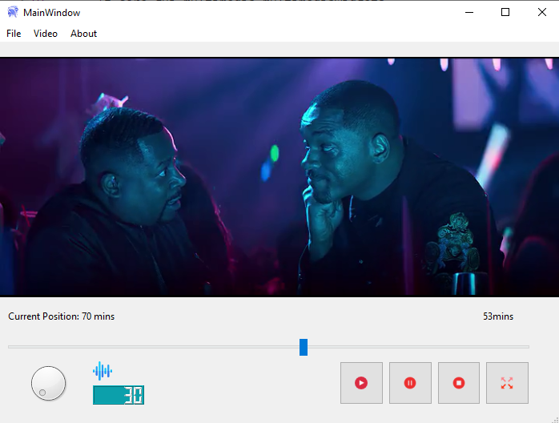
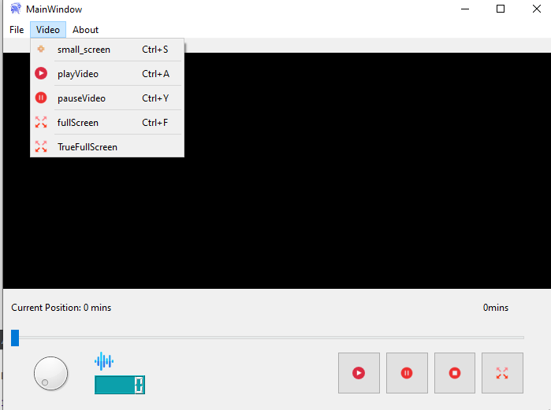

#  Spartan-Player 

    

## This is a small side project of mine, a media player which was programmed in C++ and Qt.

The program can play different video formats such as mkv or mpv4 and of course resize the screen of the played video. As previously mentioned, it was created by using C++ and the Qt-Framework and also the gcc compiler. 

* Open-Source media player
* Media-Player
* QT
* C++
* QtMultimedia Widget
* mpv4
* mkv

#   

## How to get the software up and running ?

For now, I have not got any installer ready yet, but you can just clone the repo and make yourself an executable in the following.

1. Clone the repo 
-> git clone https://github.com/Dave200s1/Spartan-Player.git
2. cd into the project folder
-> cd Spartan-Player/
3. Run qmake Note: on some Distros like Fedora for instance you need to type qmake-qt4
->qmake -Spartan-Player
4. Run make
-> make
5. You have an executable
->./Spartan-Player

## How to tweak this project for your own uses ?

Simply clone the repo and build from source.

## Known issues

Keep in mind there are some issues thus this is my first project which I am contributing, and I am not by any means a professional.

1. Window is not adjustable (In theory you can, but It doesn't scale).
2. The Timestamps are only counting in mins for now and not in minutes and seconds.
3. There is no option to add subtitles yet.
4. If you go true full screen, you cannot interact with the other settings.

